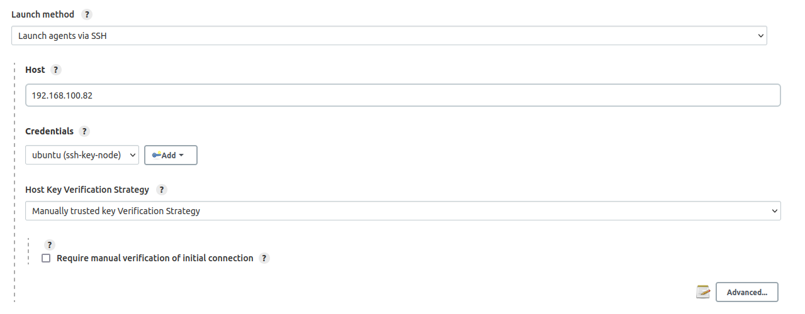
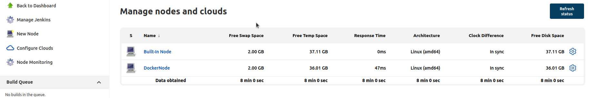
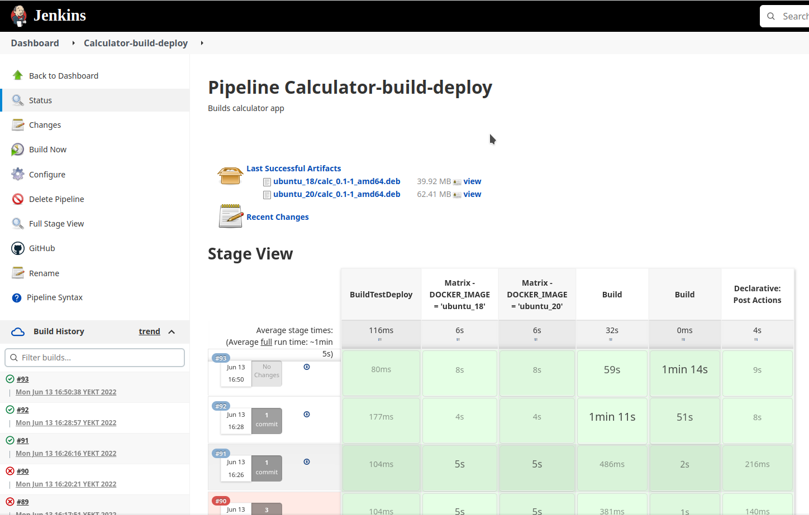

# Проект

В работе сделана попытка решить проблему доставки linux-приложений конечному пользователю для дистрибутивов на основе debian с помощью инструментов CI/CD.


# Проблема

Не смотря на то, что исходный код приложения может не отличаться для разных linux дистрибутивов, во многих случаях скомпилированное приложение запустится только на том дистрибутиве, на котором оно было скомпилировано. Чаще всего причиной этого являются зависимости приложения.

У проблемы зависимостей приложения есть следующие решения:

* Статическая компановка компановка зависимостей (в том числе glibc)

    Если скомпановать все библиотеки статически, то единственной зависимостью приложения останется ядро ОС.
    В таком случае, т. к. linux поддерживает хорошую обратную совместимость системных вызовов, скомпилированное приложение будет запускаться на всех дистрибутивах с таким же или более поздним ядром.


    Недостатки:

    * Приложение не будет отслеживаться в пакетном менеджере

    * Приложение может не запуститься на дистрибутивах со старым ядром, если оно использует новые системные вызовы

* Компиляция приложения на самом старом из поддерживаемых дистрибутивов

    Обычно, зависимостью, из-за которой приложение не запускается является glibc.
    Приложение скомпилированное со старой glibc будет запускаться на всех дистрибутивах с более новой glibc.

    Недостатки:

    * Приложение не будет отслеживаться в пакетном менеджере

    * Приложение может иметь зависимости, которые ОЧЕНЬ проблематично установить на старые дистрибутивы (например, новая версия python и т. д.)

* Сборка snap-а

    Snap-ы работают по принципу «все свое ношу с собой», что идейно похоже на статическую компановку зависимостей.

    Недостатки:

    * Для маленьких приложений является избыточным носить с собой все зависимости, которые могут в несколько раз превышать размер приложения.

* SaaS

    Предоставлять доступ к приложению удаленно

    Недостатки:

    * Overkill для небольших приложений

    * У пользователей может не быть доступа в интернет (особенно актуально для рабочих мест под гостайну)

* Сборка deb-пакета

    В данном варианте приложение должно быть скомпилировано на каждом из поддерживаемых дистрибутивов, после чего упаковано в deb-пакет.

    Недостатки:

    * Нужно компилировать приложение под каждый дистрибутив отдельно


# Задача

Автоматизировать компиляцию приложения и сборку deb-пакетов для произвольного количества debian-подобных дистрибутивов linux.

Упаковка приложения в deb-пакеты была выбрана по следующим причинам:

* Приложение будет устанавливаться через пакетный менеджер, что облегчит его установку/удаление/обновление

* Пакетный менеджер apt предустановлен в любом debian-подобном дистрибутиве

* Обеспечивает минимальный overhead приложения в ОС, что уменьшает нагрузку на файловый кэш и размер приложения на диске

* Приложение не будет зависеть от доступа в интернет


# Реализация

## Предполагаемый сценарий

1. Разработчик приложения делает push исходного кода приложения в удаленный репозиторий

1. В системе CI/CD запускается сборка deb-пакетов в контейнерах, соответствующих целевым дистрибутивам

1. При необходимости, собранные deb-пакеты могут быть загружены из системы CI/CD.

Система CI/CD используется для постоянной поддержки артефактов сборки в актуальном состоянии.

Контейнеры используются как легковесная альтернатива виртуальным машинам, т. к. для компиляции и сборки deb-пакета не нужна вся функциональность виртуальных машин.


## Используемые инструменты

* 2 виртуальные машины с Ubuntu 20.04 (Master и Slave для CI/CD)

* Система CI/CD Jenkins

    Jenkins выбран по причине свободного ПО. В качестве альтернативы рассматривались GitHub Actions и TeamCity.

    GitHub Actions накладывает ограничение на  время выполнения пользовательских сценариев, а TeamCity на количество slave-ов.
* Docker.

    Интегрируется с Jenkins с помощью плагина.


## Сборка проекта

1. Упаковать исходный код программы в архив с названием **<project_name>_<project_version>.orig.tar.gz**, где **<project_name>** - название проекта (все символы _ в **<project_name>** должны быть заменены на -), **<project_version>** - версия программы.

    Архив необходимо поместить в родительскую для исходного кода папку.

1. В папке проекта выполнить:

    ```sh
    dh_make -e <author_email> -p <project_name>_<project_version>
    ```

    , где **<author_email>** - электронная почта автора программы, **<project_name>** и **<project_version>** - имя проекта и версия программы (см. предыдущий пункт).

    В меню выбора типа пакета выбрать single. В корневой папке будет создана папка **debian** с файлами, необходимыми для создания deb-пакета.

1. Из папки debian удалить все файлы с расширениями .ex, .EX и .docs, а также файлы README.Debian, README.source, copyright.

1. Отредактировать файл control в папке **debian**: добавить зависимости для запуска программы в поле Depends.

1. Создать файл **<project_name>.install** в папке **debian**.

    В файле **<project_name>.install** необходимо указать соответствия **<файл>:<папка, в которую будет помещен файл при установке deb-пакета>**. Пути папок должны быть абсолютные, без указания символа корневого каталога (/).

1. Отредактировать файл rules в папке **debian**

    Добавить цели **build** и **clean**, которые будут компилировать приложение и удалять артефакты сборки.

1. В папке проекта выполнить команду

    ```sh
    dpkg-buildpackage -us -uc
    ```

    Команда должна скомпилировать приложение и собрать deb-пакет. Deb-пакет будет помещен в папку проекта.

1. Папку **debian** необходимо внести в систему контроля версий, команду ``dh_make`` для проекта выполнять больше не потребуется.


## Подготовка CI/CD

1. На первую ВМ (Jenkins Master) [установить Jenkins](https://www.knowledgehut.com/blog/devops/install-jenkins-ubuntu).

1. На вторую ВМ (Jenkins Slave) установить пакеты **docker.io**, **openssh-server** и **default-jre**.

1. Обеспечить доступ по ssh без пароля с Master-а на slave:

    ```sh
    ssh-keygen -t rsa
    ssh-copy-id -i ~/.ssh/id_rsa ${NODE_USER}@${NODE_ADDRESS}
    ```

1. Подключить ноду к master-у

    В веб интерфейсе Jenkins: **Manage Jenkins -> Manage nodes and clouds -> New Node**.

    Создать ноду типа Permanent, указать параметры ноды, выбрать **Launch Method: Launch agents via SSH** и вставить приватный ключ (создан в предыдущем пункте) в соответствующее поле.

    

    Убедиться в веб интерфейсе, что нода доступна

    

1. В  веб интерфейсе Jenkins выбрать **New Item -> Pipeline**

    В разделе **Pipeline** выбрать **Pipeline script from SCM** и указать адрес репозитория приложения.

1. В репозиторий проекта добавить **Jenkinsfile**


## Пример проекта

В качестве примера было взято простое desktop-приложение на python, использующее PyQt5 для создания GUI.

[Репозиторий проекта](https://github.com/Feelinglight/pyqt_calculator)

Основной код приложения находится в папке **pyqt_calculator**, там же находится папка **debian** для сборки deb-пакета, подготовленная по инструкции выше.

В корне проекта находятся следующие файлы:

* **dockerfiles** - папка с Dockerfile для всех дистрибутивов, на которые планируется доставлять приложение. В Dockerfile устанавливаются все зависимости приложения с помощью пакетных менеджеров apt и pip.

* **build_exe.py** - скрипт для сбокри приложения в исполняемый файл. Аналог компиляции для компилируемых языков. Запускается при сборке deb-пакета с помощью цели **build** в файле **debian/rules**

* **build_deb.py** - скрипт для сборки deb-пакета. Упаковывает исходный код в архив **tar.gz** и запускает процесс сборки deb-пакета.

* **Jenkinsfile** - файл pipeline-а Jenkins. Собирает образы Docker для всех Dockerfile и запускает **build_deb.py** внутри образа. После окончания собирает артефакты сборки в виде deb-пакетов.

Конфигурация job-ы Jenkins для проекта находится в файле **Calculator-build-deploy-job.xml** (сохранена отдельно от проекта)

Сборка deb-пакета запускается вручную из веб-интерфейса Jenkins.

При желании можно настроить github для автоматического запуска сборки при push-е в репозиторий. Проблема данного подхода заключается в том, что Master узел Jenkins должен иметь белый ip-адрес.

Успешная сборка выглядит следующим образом:



По ссылкам на странице job-ы можно скачать собранные deb-пакеты.

При желании можно загружать артефекты сборки через jenkins-cli, либо настроить отправку на удаленный узел через SSH.


